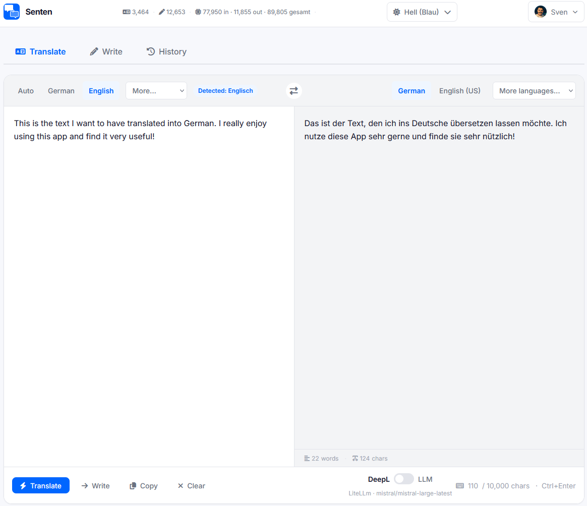

# Senten

[](https://www.python.org/)
[](LICENSE)
[](https://github.com/TheBigS1981/Senten/pkgs/container/senten)


A self-hosted web interface for the DeepL API or your favourite local or cloud LLM. Translate texts in over 30 languages or optimise your writing style without using the DeepL web interface. 



## Features

- **Translation**: Automatic language detection → 30+ target languages
- **Writing Optimization**: Style improvement via double translation (forward + back)
- **LLM Support**: Engine toggle (DeepL ↔ LLM) — OpenAI, Anthropic, Ollama, or OpenAI-compatible proxy (e.g., LiteLLM)
- **SSE Streaming**: Real-time incremental output for LLM translations
- **Output Statistics**: Words, characters, tokens (input/output), estimated EUR cost
- **Diff View**: Visual highlighting of changes (insertions/deletions)
- **History**: Session-based translation/optimization history with auto-save
- **Auto-Processing**: 2-second debouncing while typing
- **Usage Tracking**: Real-time character counting with SQLite persistence (cumulative 4-week stats)
- **Engine Persistence**: DeepL/LLM selection saved in localStorage
- **User Management**: Admin user creation, profile editing, Gravatar
- **Dark Mode**: System-based or manual toggle
- **Keyboard Shortcuts**: Ctrl+Enter (execute), Ctrl+1/2 (tab switch), Ctrl+D (theme toggle), Escape (clear)
- **Prompt Injection Protection**: Pattern-based detection of injection attempts on LLM endpoints
- **Language Swap**: One-click swap of source and target language
- **User Authentication**: Session cookie auth with login/logout, admin panel, password change

## Tech Stack

| Layer | Technology |
|---|---|
| Backend | Python 3.11, FastAPI 0.115+, uvicorn |
| Database | SQLite via SQLAlchemy 2.0 (WAL mode) |
| Frontend | Vanilla JavaScript, Jinja2 templates |
| CSS | Tailwind CSS v3 (compiled), CSS Custom Properties |
| Diff Display | jsdiff v5.1.0 |
| Auth | OIDC/JWT, HTTP Basic Auth, or anonymous |

## Quick Start

1. Copy `.env.example` to `.env` and adjust:

```bash
cp .env.example .env
# Set DEEPL_API_KEY (optional — without key: mock mode)
```

2. Start with Docker:

```bash
docker compose up --build
```

3. Open `http://localhost:8000`

## Local Development

### Prerequisites

- Python 3.11+
- Node.js 18+
- Docker (optional)

### Setup

```bash
# Python dependencies
pip install -r requirements.txt

# Node dependencies + CSS build
npm install && npm run build:css

# Configure environment variables
cp .env.example .env

# Start development server (with hot reload)
uvicorn app.main:app --reload
```

The SQLite database is created automatically on first start.

### Build CSS

```bash
npm run build:css   # one-time
npm run watch:css   # watch mode for development
```

### Tests

```bash
# All tests (no DEEPL_API_KEY required — runs in mock mode)
pytest

# With coverage
pytest --cov=app --cov-report=term-missing
```

## Docker

```bash
# Build and start
docker compose up --build

# Start in background
docker compose up -d

# View logs
docker compose logs -f

# Stop
docker compose down
```

## Authentication

Three modes — auto-detected based on environment variables set:

| Mode | Condition |
|---|---|
| OIDC | `OIDC_DISCOVERY_URL` set |
| HTTP Basic Auth | `AUTH_USERNAME` + `AUTH_PASSWORD` set, no OIDC |
| Anonymous | No auth variables set |

## Environment Variables

All variables are optional. Without `DEEPL_API_KEY`, the app runs in mock mode.

| Variable | Default | Description |
|---|---|---|
| `DEEPL_API_KEY` | — | DeepL API Key |
| `SECRET_KEY` | random | Session signing key (recommended: `openssl rand -hex 32`) |
| `DATABASE_URL` | `sqlite:///./data/senten.db` | SQLAlchemy DB URL |
| `MONTHLY_CHAR_LIMIT` | `500000` | Monthly character budget |
| `ALLOWED_ORIGINS` | — | CORS origins, comma-separated |
| `ALLOW_ANONYMOUS` | `true` | Allow anonymous access (`false` = login required) |
| `SESSION_LIFETIME_HOURS` | `168` | Session lifetime in hours (7 days) |
| `SESSION_LIFETIME_REMEMBER_HOURS` | `720` | Session lifetime with "remember me" (30 days) |
| `ADMIN_USERNAME` | — | Admin username (created on first start) |
| `ADMIN_PASSWORD` | — | Admin password (created on first start) |
| `SESSION_COOKIE_SECURE` | `true` | Session cookie with `Secure` flag (`false` for HTTP-only setups) |
| `IS_PRODUCTION` | `false` | Disable Swagger/Redoc UI (`/docs`, `/redoc`, `/openapi.json`) |
| `TRUSTED_PROXIES` | `127.0.0.1,::1` | Trusted reverse proxy IPs (for `X-Forwarded-For`) |
| `OIDC_DISCOVERY_URL` | — | OIDC Discovery URL |
| `OIDC_CLIENT_ID` | — | OIDC Client ID |
| `OIDC_CLIENT_SECRET` | — | OIDC Client Secret |
| `AUTH_USERNAME` | — | HTTP Basic Auth username |
| `AUTH_PASSWORD` | — | HTTP Basic Auth password |
| `LOG_DIR` | `data` | Log file directory |
| `RATE_LIMIT_PER_MINUTE` | `30` | Requests per minute per IP |
| `RATE_LIMIT_BURST` | `10` | Burst limit for load spikes |
| `LLM_PROVIDER` | — | LLM provider: `openai`, `anthropic`, `ollama`, `openai-compatible` |
| `LLM_API_KEY` | — | API key (optional for Ollama and `openai-compatible`) |
| `LLM_BASE_URL` | — | Base URL (required for Ollama and `openai-compatible`) |
| `LLM_DISPLAY_NAME` | — | UI label in engine toggle (e.g., `LiteLLM`) |
| `LLM_TIMEOUT` | `30` | Timeout in seconds for LLM requests (min: 1) |
| `LLM_TRANSLATE_MODEL` | `gpt-4o` | Model for translations |
| `LLM_WRITE_MODEL` | `gpt-4o` | Model for text optimization |
| `LLM_MAX_INPUT_CHARS` | `5000` | Hard cap on input length (cost guard, 1-50000) |

## LLM Configuration

When `LLM_PROVIDER` is set, a toggle appears in the "Translate" and "Optimize" tabs
to switch between DeepL and LLM. The toggle is independent per tab.

### Supported Providers

| Provider | `LLM_PROVIDER` | Key Required | Base URL Required |
|---|---|---|---|
| OpenAI | `openai` | Yes | No |
| Anthropic | `anthropic` | Yes | No |
| Ollama (local) | `ollama` | No | Yes (`http://localhost:11434`) |
| OpenAI-compatible proxy | `openai-compatible` | Optional | Yes |

### Error Behavior (LLM-specific)

LLM errors are mapped to specific HTTP status codes:

| HTTP Status | Cause |
|---|---|
| `408` | Timeout — provider did not respond in time |
| `401` | Auth error — invalid or missing API key |
| `429` | Quota/rate limit exceeded |
| `422` | Model not found or unavailable |
| `503` | Provider unreachable (connection error) |

### Example: LiteLLM proxy

```env
LLM_PROVIDER=openai-compatible
LLM_BASE_URL=http://litellm:4000
LLM_API_KEY=optional-master-key   # leave empty if no auth
LLM_DISPLAY_NAME=LiteLLM          # Label in UI toggle
LLM_TRANSLATE_MODEL=gpt-4o
LLM_WRITE_MODEL=gpt-4o
LLM_TIMEOUT=60                    # increase for slow models
```

### Example: Ollama (local)

```env
LLM_PROVIDER=ollama
LLM_BASE_URL=http://localhost:11434
LLM_TRANSLATE_MODEL=llama3.2
LLM_WRITE_MODEL=llama3.2
LLM_TIMEOUT=120                   # local models can be slow
```

---

## API

Swagger UI: `http://localhost:8000/docs` (only if `IS_PRODUCTION=false`, which is the default)

| Method | Path | Description |
|---|---|---|
| GET | `/` | Web interface |
| GET | `/health` | Liveness probe |
| GET | `/health/ready` | Readiness probe (checks DB + DeepL) |
| POST | `/api/translate` | Translate text |
| POST | `/api/translate/stream` | Translate text (SSE streaming for LLM) |
| POST | `/api/write` | Optimize text |
| POST | `/api/write/stream` | Optimize text (SSE streaming for LLM) |
| GET | `/api/config` | API configuration status |
| GET | `/api/usage` | Usage statistics |

## Security

- Content Security Policy (CSP) with nonce-based `script-src`, `style-src: 'unsafe-inline'`
- X-Frame-Options: DENY
- X-Content-Type-Options: nosniff
- HSTS (Strict-Transport-Security) — only sent over HTTPS
- Referrer-Policy: strict-origin-when-cross-origin
- Session cookie `HttpOnly`, `SameSite=lax`, `Secure` configurable
- X-Forwarded-For only accepted from trusted proxies
- Login rate limit: 5 attempts per minute per IP
- Generic HTTP error messages (no internal details to client)

## Troubleshooting

**DeepL API not configured:**
Without `DEEPL_API_KEY`, the app runs in mock mode — all responses are placeholders.

**LLM toggle not appearing:**
`LLM_PROVIDER` must be set. For `openai-compatible`, `LLM_BASE_URL` must also be set — if missing, LLM is disabled at startup (warning in log).

**LLM error 408 (timeout):**
Increase `LLM_TIMEOUT` (e.g., `LLM_TIMEOUT=120` for slow local models).

**LLM error 503 (unreachable):**
Check `LLM_BASE_URL`. For Ollama: ensure the Ollama service is running and the URL is correct.

**Database error:**
The `data/` directory must be writable by the process.
In Docker, it's mounted as a volume.

**CSS not up to date:**
Run `npm run build:css` and clear browser cache.

**Login not working (cookie not set):**
If accessing via HTTP (no HTTPS), set `SESSION_COOKIE_SECURE=false` in `.env`. With HTTPS access via a reverse proxy (Nginx, Caddy, NPM), `SESSION_COOKIE_SECURE=true` (default) should work correctly.

**Swagger UI not accessible:**
Set `IS_PRODUCTION=false` (or omit — default is `false`).

**Hide `/docs` in production:**
Set `IS_PRODUCTION=true` in `.env`.

---

## Contributing

Contributions are welcome! Please see [CONTRIBUTING.md](CONTRIBUTING.md) for details.

## Changelog

For a full list of changes, see [CHANGELOG.md](CHANGELOG.md).
